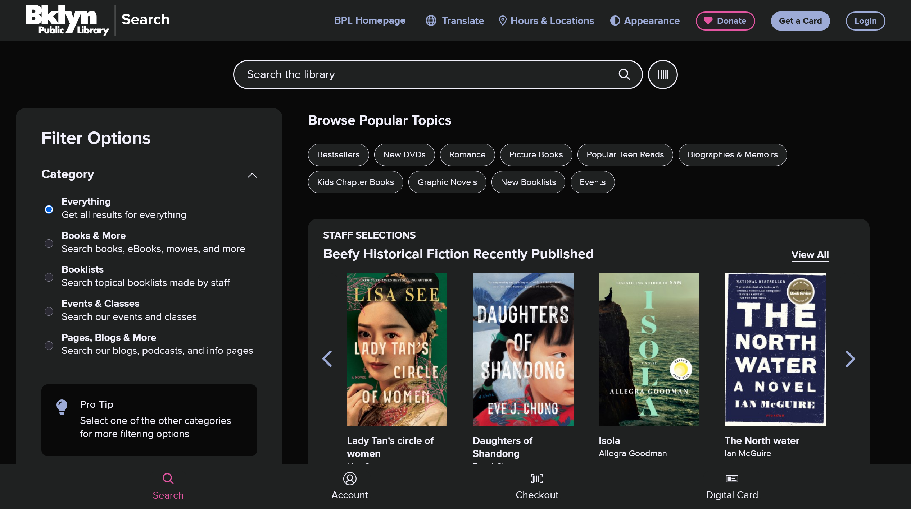
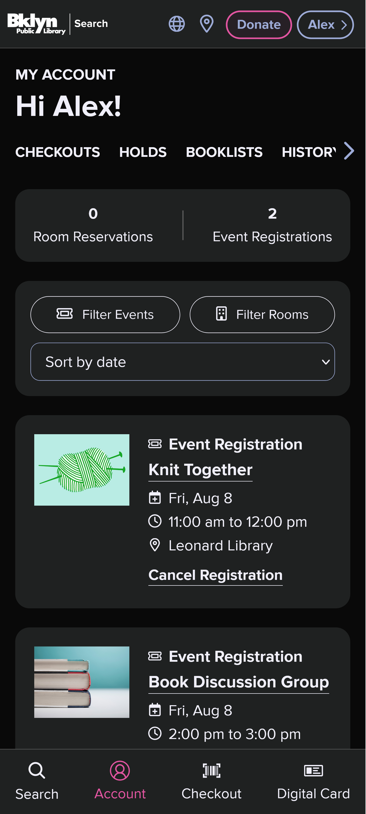
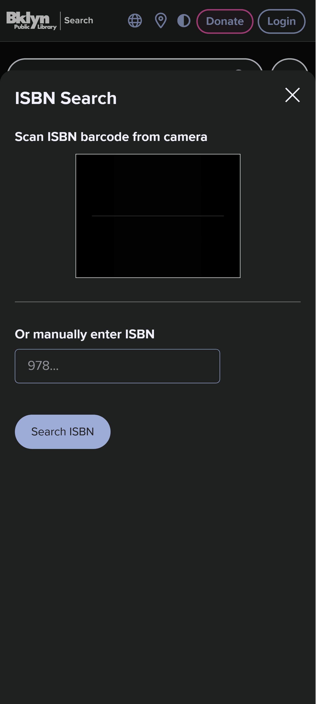
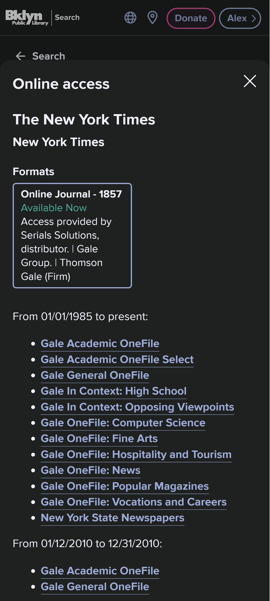

# Hi, I'm Alex 👋

**Full-Stack Software Engineer** based in NYC.
I specialize in bridging legacy backends with modern, accessible frontends. Currently completing my B.S. in CS at Binghamton University (Dec 2025).

[LinkedIn](https://www.linkedin.com/in/alex-chen-hsieh) • [Email](mailto:alexh04@outlook.com)

## Featured Work
### Brooklyn Public Library App
**Tech Stack:** React, React Native, PHP, MySQL, Node.js, AWS

During my Summer 2025 internship, I engineered key features for the BPL web and mobile platforms to enhance accessibility and user experience for patrons.

 

  
   
  <em>Designed and implemented a system-wide <strong>Dark Mode</strong>.</em>

 

<table width="100%">
  <tr>
    <td width="33%" valign="top" align="center">
      
       
      <strong>Unified Dashboard</strong> Real-time room reservations
    </td>
    <td width="33%" valign="top" align="center">
      
       
      <strong>Camera Search</strong> Scanning physical books
    </td>
    <td width="33%" valign="top" align="center">
      
       
      <strong>Resource Integration</strong> Unified access for journals
    </td>
  </tr>
</table>